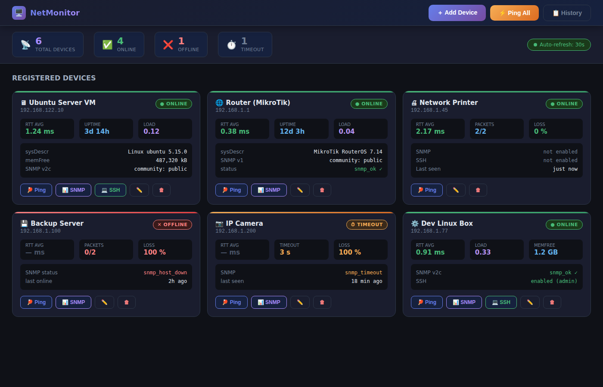
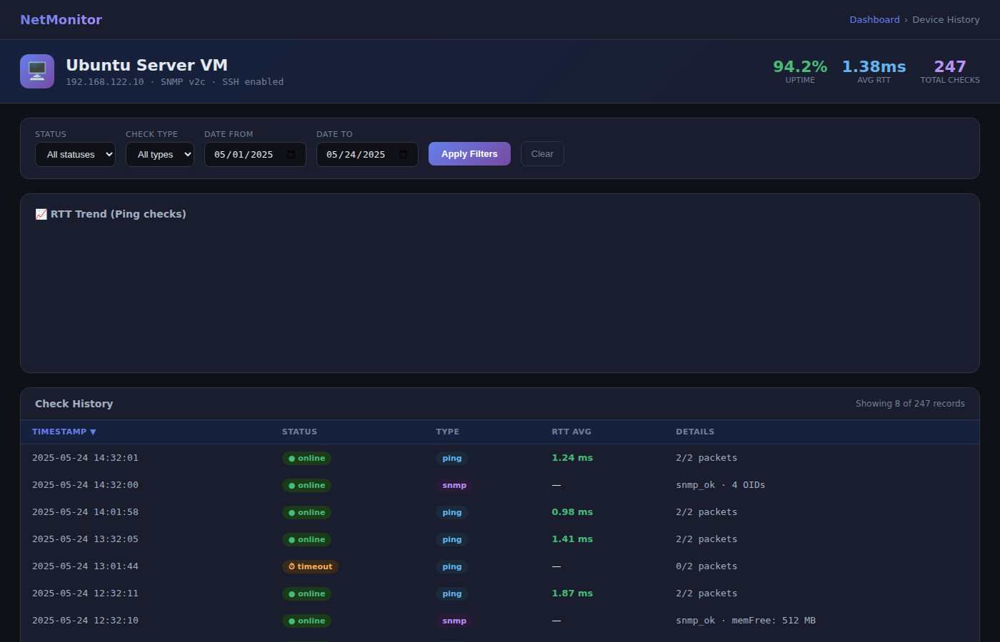
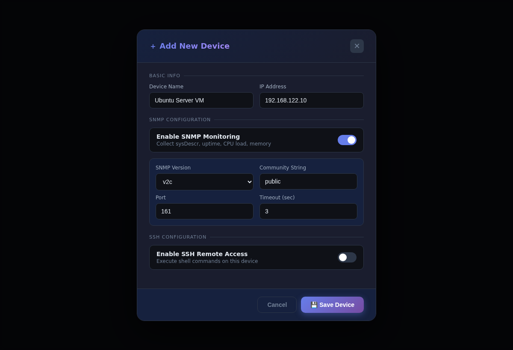
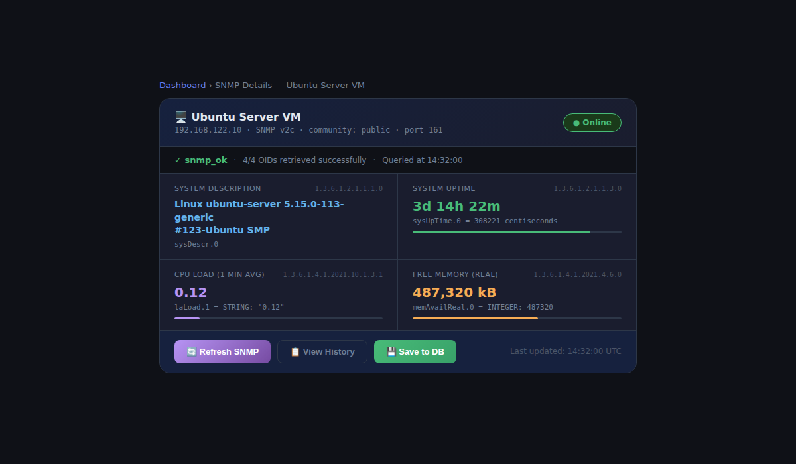

# 🖥️ Network Monitoring System

> An interactive web-based system for monitoring and managing network devices.  
> Built with **Flask** · **SQLite** · **pysnmp** · **paramiko** · **Chart.js**


---

## 📸 Screenshots

| Dashboard | Device History |
|-----------|---------------|
|  |  |

| Add Device | SNMP Metrics |
|------------|--------------|
|  |  |

---

## ✨ Features

| Category | Capability |
|---|---|
| **Device Management** | Add, edit, delete devices; store IP, SNMP, SSH config in SQLite |
| **ICMP Ping** | Ping one device or all; RTT parsing via pingparsing; cross-platform (Linux/Windows) |
| **SNMP v1/v2c** | Collect sysDescr, sysUpTime, laLoad1, memAvailReal per device |
| **SSH** | Execute shell commands on devices via paramiko (Fernet-encrypted credentials) |
| **History** | Persistent check history with filtering by status/type/date and sortable table |
| **RTT Chart** | Chart.js line chart of ping RTT over time on the device history page |
| **Auto-refresh** | Configurable periodic background polling of all devices |
| **Docker** | Multi-stage Dockerfile + docker-compose for one-command deployment |

---

## 🗂️ Project Structure

```
network_monitoring/
├── backend/
│   ├── app.py           # Application factory (create_app)
│   ├── extensions.py    # SQLAlchemy singleton
│   ├── models.py        # Device + PingHistory ORM models
│   ├── schemas.py       # Marshmallow validation schemas
│   ├── security.py      # Fernet SSH password encryption
│   ├── utils.py         # perform_ping() + get_snmp_data()
│   └── routes/
│       ├── main_routes.py    # Serves frontend HTML
│       ├── device_routes.py  # CRUD + SNMP + SSH endpoints
│       └── history_routes.py # History CRUD + stats endpoint
├── frontend/
│   ├── index.html            # Main dashboard
│   ├── device_history.html   # Per-device history + RTT chart
│   ├── css/
│   │   ├── main.css
│   │   └── device_history.css
│   └── js/
│       ├── main.js            # Bootstrap & initialization
│       ├── uiUpdater.js       # DOM helpers
│       ├── deviceManagement.js
│       ├── pingLogic.js
│       ├── snmpLogic.js
│       ├── historyLogic.js
│       ├── historyModal.js
│       ├── globalStats.js
│       ├── autoRefresh.js
│       └── device_history.js
├── docs/
│   └── screenshots/      # UI screenshots
├── config.py             # Dev/Prod/Test config classes
├── run.py                # Entry point
├── requirements.txt
├── Dockerfile
├── docker-compose.yml
└── .env.example
```

---

## 🚀 Quick Start

### Option A — Docker (recommended)

```bash
git clone https://github.com/<your-username>/network-monitoring.git
cd network-monitoring

cp .env.example .env       # edit SECRET_KEY etc.
docker compose up --build
```

Open **http://localhost:5000**

### Option B — Local Python

**Prerequisites:** Python 3.10+, `ping` utility in PATH

```bash
# 1. Clone
git clone https://github.com/<your-username>/network-monitoring.git
cd network-monitoring

# 2. Virtual environment
python -m venv venv
source venv/bin/activate          # Windows: venv\Scripts\activate

# 3. Install deps
pip install -r requirements.txt

# 4. Environment
cp .env.example .env
# Edit .env: set SECRET_KEY and SSH_ENCRYPTION_SECRET

# 5. Run
python run.py
```

Open **http://localhost:5000**

---

## 🖥️ Test VM — Download & Run

The project was tested against a pre-configured Linux VM with SNMP and SSH already enabled.

### Download

The VM image is hosted on Hugging Face (3 GB):

```bash
# Install HF CLI
pip install huggingface_hub

# Download all VM files into ./vm/ directory
huggingface-cli download melmonreaz/network-monitoring-vm \
  --repo-type dataset \
  --local-dir ./vm
```

Or download manually: **https://huggingface.co/datasets/melmonreaz/network-monitoring-vm**

Files in the archive:

| File | Description |
|------|-------------|
| `*.qcow2` | Virtual disk image (Linux OS, pre-configured) |
| `efi_vars.fd` | EFI variables — required for boot |
| `config.plist` | UTM config (reference only, not needed on Linux) |

---

## 🖥️ Setting Up a Test Device (QEMU/KVM + qcow2)

The project was developed and tested against a **Linux VM** provided as a `.qcow2` disk image.  
Below is a complete guide to launching the VM, enabling SNMP/SSH, and connecting the monitor to it.

### What is a qcow2 file?

A `.qcow2` file is a virtual hard disk image in QEMU Copy-On-Write format — the standard disk format for KVM/QEMU virtual machines. It contains a full Linux installation ready to boot.

---

### Step 1 — Prerequisites

```bash
# Ubuntu / Debian
sudo apt update
sudo apt install -y qemu-kvm libvirt-daemon-system virt-manager

# Check KVM is available
kvm-ok
# Expected: "KVM acceleration can be used"

# Add yourself to the kvm group (log out and back in after)
sudo usermod -aG kvm,libvirt $USER
```

---

### Step 2 — Boot the VM from the qcow2 image

#### Option A — virt-manager (GUI, easiest)

```bash
virt-manager
```

1. **File → New Virtual Machine → Import existing disk image**
2. Browse to your `.qcow2` file
3. Set OS type: **Generic Linux**
4. RAM: 512 MB is enough; CPUs: 1
5. ✅ **"Customize configuration before install"** → set Network to **Bridge** or **NAT**
6. Click **Begin Installation**

#### Option B — command line

```bash
qemu-system-x86_64 \
  -m 512 \
  -hda /path/to/your-image.qcow2 \
  -net nic \
  -net user,hostfwd=tcp::2222-:22,hostfwd=udp::16100-:161 \
  -nographic
```

> `-hostfwd` maps host port **2222 → VM port 22** (SSH) and  
> host port **16100 → VM port 161** (SNMP UDP).

---

### Step 3 — Find the VM IP address

If you used **bridge networking** (virt-manager default), the VM gets a real LAN IP:

```bash
# Inside the VM (after login):
ip addr show
# Look for inet 192.168.x.x under eth0 or enp1s0

# From the host — list all VMs and their IPs:
virsh list --all
virsh domifaddr <vm-name>
```

If you used **NAT** with port forwarding, connect via `127.0.0.1:2222`.

---

### Step 4 — Enable SNMP on the VM

```bash
# SSH into the VM first
ssh user@<VM_IP>
# (or: ssh -p 2222 user@127.0.0.1  for port-forwarded NAT)

# Install SNMP daemon
sudo apt update
sudo apt install -y snmpd snmp

# Edit the config
sudo nano /etc/snmp/snmpd.conf
```

Replace the contents with the minimal working config:

```
# Listen on all interfaces
agentAddress udp:161,tcp:161

# Community string (matches what you set in the monitoring app)
rocommunity public 0.0.0.0/0

# Standard MIBs
view systemonly included .1.3.6.1.2.1.1
view systemonly included .1.3.6.1.2.1.25.1

# UCD-SNMP MIB — needed for CPU load and memory metrics
extend    .1 /bin/echo "test"
```

```bash
# Restart and enable
sudo systemctl restart snmpd
sudo systemctl enable snmpd

# Verify locally
snmpwalk -v2c -c public localhost 1.3.6.1.2.1.1.1.0
# Should print: SNMPv2-MIB::sysDescr.0 = STRING: Linux ...
```

---

### Step 5 — Open the firewall

```bash
# If ufw is active:
sudo ufw allow 161/udp
sudo ufw allow 22/tcp
sudo ufw reload
```

---

### Step 6 — Add the VM to the monitoring system

1. Open **http://localhost:5000** in your browser
2. Click **Add Device**
3. Fill in:
   - **Name:** anything (e.g. `Test VM`)
   - **IP Address:** the VM's IP from Step 3
   - **SNMP Enabled:** ✅
   - **SNMP Version:** 2c
   - **Community:** `public`
   - **Port:** `161`
4. Click **Save**

Now click **Ping** on the device card — you should see `online`.  
Click **SNMP** — you should see `sysDescr`, `sysUpTime`, `laLoad1`, `memAvailReal`.

---

### Step 7 — Enable SSH (optional, for remote command execution)

```bash
# Inside the VM:
sudo apt install -y openssh-server
sudo systemctl enable --now ssh

# Test from host:
ssh user@<VM_IP>
```

In the monitoring app → Edit Device → enable **SSH**, enter username and password.  
Use the **SSH Command** feature to run arbitrary shell commands on the VM from the web UI.

---

### Troubleshooting SNMP

| Symptom | Fix |
|---------|-----|
| `snmp_timeout` | Check `ufw` / `iptables`; verify `snmpd` is running: `systemctl status snmpd` |
| `snmp_host_down` | VM not reachable; check bridge/NAT networking |
| `laLoad1` / `memAvailReal` missing | Install `snmp-mibs-downloader`: `sudo apt install snmp-mibs-downloader` then restart `snmpd` |
| Wrong community string | Must match exactly what's in `snmpd.conf` (default: `public`) |

---

## 🔌 REST API Reference

### Devices

| Method | Path | Description |
|--------|------|-------------|
| `GET` | `/api/devices` | List all devices |
| `POST` | `/api/devices` | Create device |
| `GET` | `/api/devices/<id>` | Get device |
| `PUT` | `/api/devices/<id>` | Update device |
| `DELETE` | `/api/devices/<id>` | Delete device |
| `POST` | `/api/devices/<id>/snmp` | Run SNMP check |
| `POST` | `/api/devices/<id>/ssh/command` | Execute SSH command |

### Ping

| Method | Path | Body | Description |
|--------|------|------|-------------|
| `POST` | `/api/ping` | `{device_id}` or `{ip_address}` | Ping one device |
| `POST` | `/api/ping_all` | — | Ping all devices |

### History

| Method | Path | Description |
|--------|------|-------------|
| `GET` | `/api/devices/<id>/history` | Get records (filterable) |
| `POST` | `/api/devices/<id>/history` | Bulk-save session records |
| `DELETE` | `/api/devices/<id>/history` | Clear all history |
| `GET` | `/api/devices/<id>/history/stats` | Aggregate stats |

#### History filter params (GET)
`?status=online&check_type=ping&date_from=2025-01-01T00:00:00&sort_by=timestamp&sort_order=desc&limit=100`

---

## 🔐 Security Notes

- SSH passwords are encrypted at rest using **Fernet** (AES-128-CBC + HMAC-SHA256).
- The encryption key is derived from `SSH_ENCRYPTION_SECRET` via **PBKDF2-HMAC-SHA256** (100k iterations).
- `ssh_password` is `load_only=True` in the schema — it is **never** returned by the API.
- Set strong, unique values for `SECRET_KEY` and `SSH_ENCRYPTION_SECRET` in production.

---

## 🛠️ Configuration

All settings are controlled via environment variables (`.env` file):

| Variable | Default | Description |
|---|---|---|
| `SECRET_KEY` | dev key | Flask session secret |
| `FLASK_ENV` | `development` | `development` / `production` / `testing` |
| `DATABASE_URL` | SQLite in `./database/` | SQLAlchemy DB URI |
| `SSH_ENCRYPTION_SECRET` | dev key | Master secret for Fernet KDF |
| `PASSWORD_SALT_SSH` | dev salt | PBKDF2 salt |
| `PING_PACKET_COUNT_LINUX` | `2` | `-c` value for Linux ping |
| `PING_TIMEOUT_SEC_LINUX` | `1` | `-W` value for Linux ping |
| `PING_COMMUNICATE_TIMEOUT` | `3` | subprocess.communicate() timeout |

---

## 📜 License

MIT — see [LICENSE](LICENSE)
